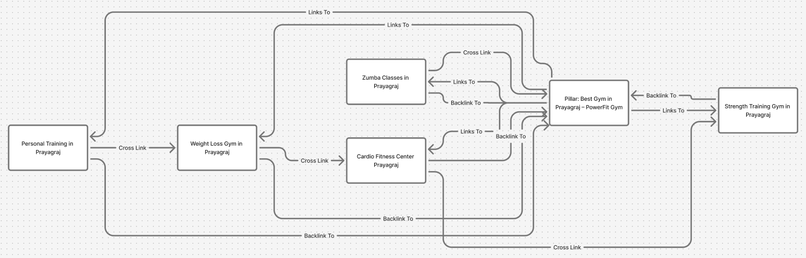

# Prompt Engineering – Task 3 (2026)

## AI SEO Blog & Content Cluster Generator for Business Websites

This repository contains my submission for Task 3 of the Prompt Engineering Internship (2026) by Future Interns.

In this task, I designed an AI-powered prompt system to generate SEO-optimized blog content and structured content clusters for a local business to improve Google rankings and generate organic leads.

---

## 📌 Project Overview

Business Chosen: PowerFit Gym  
Location: Prayagraj, Uttar Pradesh  
Industry: Fitness & Wellness  

This project focuses on creating:

- A main pillar SEO blog  
- Multiple supporting blogs  
- Internal linking strategy  
- Local SEO optimization  
- Content publishing plan  

All content is generated using structured prompts.

---

## 🎯 Objective

The main objectives of this project are:

- Generate SEO-optimized blog outlines and content  
- Create a content cluster strategy  
- Improve local search visibility  
- Target both informational and commercial search intent  
- Build topical authority for the business  

---

## 🛠 Tools Used

- ChatGPT – Prompt design and content generation  
- Google Keyword Planner / Free SEO Tools – Keyword research  
- GitHub – Documentation and version control  

---

## 📁 Repository Structure
FUTURE_PE_03/
│
├── prompts/
│   ├── v1_prompt.txt
│   └── v2_prompt.txt
│
├── outputs/
│   ├── v1_output.txt
│   └── v2_output.txt
│
├── structure/
│   ├── content_cluster_map.png
│   └── content_cluster_map.txt
│
└── README.md

---

## 🗺 SEO Content Cluster Structure

The following diagram represents the content cluster strategy for PowerFit Gym.

It shows how the pillar page and supporting blogs are internally linked to improve SEO authority.

### Content Cluster Map

---

## ✍️ Prompt Versions

### Version 1 Prompt
- Basic SEO blog generation  
- Keyword targeting  
- Basic structure  

Location:
/prompts/v1_prompt.txt

---

### Version 2 Prompt
- Improved structure  
- File naming system  
- Advanced local SEO focus  
- Clear content hierarchy  

Location:
/prompts/v2_prompt.txt

---

---

## 📄 Generated Outputs

The generated SEO content and content clusters are stored in:
/outputs/v1_output.txt
/outputs/v2_output.txt

These files contain:

- Pillar blog content  
- Supporting blog outlines  
- Internal linking plan  
- CTA structure  
- FAQ sections  

---

## 📈 Key Features of This System

- H1–H3 structured headings  
- Keyword mapping  
- Local SEO optimization  
- Search intent targeting  
- Content clustering  
- Internal linking strategy  
- Lead-focused CTAs  

---

## 🎓 Learning Outcomes

Through this task, I learned:

- How SEO content clusters work  
- How to structure pillar and supporting pages  
- Keyword intent mapping  
- Local SEO optimization  
- Content planning for long-term ranking  
- Prompt engineering for scalable content systems  

---

## ✅ Final Deliverables

- AI-generated SEO pillar blog  
- Supporting content cluster  
- Internal linking strategy  
- Content cluster diagram  
- Structured prompts  
- Organized documentation  

---

## 🏁 Conclusion

This project demonstrates how structured prompt engineering can be used to design professional SEO content systems for real businesses.

The system is optimized for ranking, lead generation, and long-term digital growth.

